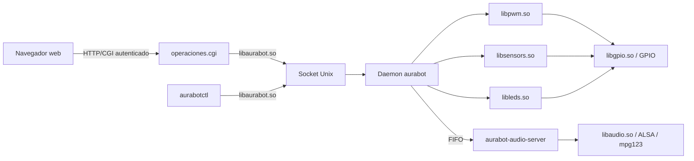
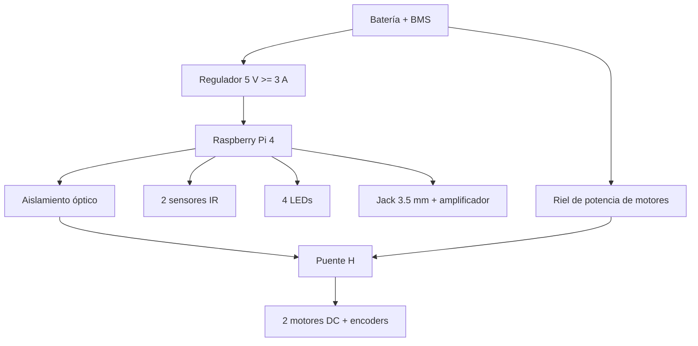

# AuraBot - robot aspiradora autónomo con Yocto

Proyecto I de CE-1113 Sistemas Empotrados, Instituto Tecnológico de Costa Rica.
AuraBot es un robot diferencial sobre Raspberry Pi 4 con navegación reactiva,
dos sensores de proximidad, odometría, mapa incremental, cuatro indicadores
LED, reproducción MP3 concurrente y control web autenticado.

## Integrantes

- José Bernardo Barquero Bonilla (2023150476)
- Jose Eduardo Campos Salazar (2023135620)
- Jimmy Feng Feng (2023060347)
- Alexander Montero Vargas (2023166058)

Profesor: Dr.-Ing. Jeferson González Gómez.

## Arquitectura





El daemon es el único propietario del hardware. La web y las herramientas no
conocen GPIO físicos: usan exclusivamente `libaurabot.so`. La especificación y
el contrato público están documentados en
[hardware-api-implementation-plan.md](docs/architecture/hardware-api-implementation-plan.md)
y [web-control.md](docs/web-control.md).

## Construcción reproducible

Requisitos del host:

- Poky Scarthgap 5.0.19 y `meta-raspberrypi` en el mismo árbol.
- Dependencias de compilación de Yocto para la distribución del host.
- Espacio para `downloads`, `sstate-cache` y el build de Raspberry Pi 4.

La capa activa es `meta-ce1113`; `build.sh` agrega automáticamente esa capa y
`meta-raspberrypi`, fija `INIT_MANAGER = "systemd"` y ejecuta únicamente:

```sh
POKY_DIR=/ruta/poky-scarthgap-5.0.19 \
./build.sh --no-ui --machine raspberrypi4 --image ce1113-p1
```

La imagen hereda `core-image-minimal` y genera `.ext4`, `.tar.bz2` y `.wic.bz2`.
El script valida el manifest y la integridad del WIC. No se requiere compilar
manualmente ningún binario fuera de BitBake.

Antes de producir una imagen entregable, agregar fuera del bloque administrado
de `build-raspberrypi4/conf/local.conf`:

```bitbake
AURABOT_WEB_USERNAME = "operador"
AURABOT_WEB_PASSWORD = "una-frase-larga-y-unica"
AURABOT_WEB_AUTH_SALT = "valor-unico-para-este-robot"
```

La contraseña en texto claro se utiliza solo al construir; el rootfs recibe un
hash SHA-256 salteado e iterado. El usuario inicial de desarrollo es `admin` y
la contraseña `AuraBot-CE1113!`.

## Instalación y arranque

```sh
./flash_sd.sh --device /dev/mmcblk0
```

El flasheo crea una tercera partición persistente, `AURA_AUDIO`, para música y
playlist. Al arrancar, `systemd` habilita automáticamente:

| Unidad | Función | Recuperación |
| --- | --- | --- |
| `aurabot-wifi.service` | Asociación WPA | `Restart=on-failure` |
| `aurabot-wifi-dhcp.service` | Dirección IPv4 por DHCP | `Restart=on-failure` |
| `media-audio.mount` | Montaje de `AURA_AUDIO` | Reintento mediante systemd |
| `aurabot-audio.service` | Reproductor persistente | `Restart=on-failure` |
| `aurabot.service` | Navegación, mapa y hardware | `Restart=on-failure` |
| `webapp-httpd.service` | BusyBox HTTP/CGI | `Restart=on-failure` |

No se instala interfaz gráfica local ni scripts SysV. Diagnóstico básico:

```sh
systemctl --failed
systemctl status aurabot.service aurabot-audio.service webapp-httpd.service
systemctl show aurabot.service webapp-httpd.service -p Restart -p NRestarts
journalctl -b -u aurabot.service -u webapp-httpd.service
```

La interfaz se abre en `http://IP_DEL_ROBOT/`. Permite cambiar de modo, conducir
en manual, observar sensores, motores, mapa y LEDs, y controlar pista, volumen y
dispositivo de audio. Los recursos visuales están dentro de la imagen y no usan
CDN ni conexión a Internet.

## Paquetes añadidos y justificación

La imagen final excluye `packagegroup-ce1113-test`, `app-operaciones`,
`encoder-count` y `prueba-encoder`. Esas recetas permanecen disponibles solo
para desarrollo.

| Paquete o grupo | Justificación |
| --- | --- |
| `packagegroup-ce1113-lib` | Bibliotecas compartidas GPIO, PWM, sensores, LEDs, audio y API pública |
| `packagegroup-ce1113-auraapp` | Daemon, servidor de audio y panel web requeridos por el producto |
| `packagegroup-base-alsa`, `alsa-utils-amixer`, `mpg123` | Salida ALSA, volumen y decodificación MP3 |
| `wpa-supplicant`, firmware Broadcom, `wireless-regdb` | Control remoto mediante Wi‑Fi de la Raspberry Pi 4 |
| `udev-rules-rpi` y módulos de kernel seleccionados | Reglas del BSP sin instalar el conjunto completo `kernel-modules` |
| `busybox` con HTTP/CGI | Servidor web pequeño, sin framework ni GUI |
| `systemd`, `systemd-analyze` | Inicio automático, reinicio ante fallos y medición del arranque |
| módulos `brcmfmac` y `snd-bcm2835` | Wi‑Fi y jack analógico del hardware seleccionado |

## Métricas obligatorias

Con el robot navegando, reproduciendo audio y con la web abierta, ejecutar en el
target:

```sh
aurabot-metrics | tee /media/audio/aurabot-metrics.txt
```

El reporte contiene uso/tamaño del rootfs, `systemd-analyze time`, cadena crítica
hasta el servidor web, RAM, reinicios y una muestra de CPU de cinco segundos por
servicio. Los límites de referencia son rootfs <= 200 MB y servicio operativo
<= 15 s. Los valores finales deben capturarse en la Raspberry de entrega y
guardarse con las evidencias; no se sustituyen por mediciones del host o QEMU.

## Validación y pruebas

```sh
./scripts/check-repository.sh
./check_image.sh --no-ui --build-dir /ruta/poky/build-raspberrypi4
```

El núcleo incluye pruebas de FSM, navegación/mapa, hardware parcial y hardware
simulado. La integración HTTP comprueba autenticación, sesiones, propiedad del
control, expiración segura, motores, mapa, LEDs, audio y parada de emergencia.
Consulte [web-control.md](docs/web-control.md) para construir y ejecutar ese banco.

## Evidencias y entregables

El método y los archivos que todavía deben capturarse sobre la imagen final se
enumeran en [docs/evidence/README.md](docs/evidence/README.md). Incluyen el
fragmento real de `log.do_compile`, ejecución en target, servicios reiniciándose,
métricas y fotografías de la seguridad eléctrica. No se versionan builds ni se
fabrican valores de hardware.

La documentación de Diseño (DI1-DI4) y Aprendizaje Continuo (AC1-AC4) son
entregables humanos independientes; la estructura esperada está registrada en
[docs/compliance.md](docs/compliance.md).

## Seguridad física

Los GPIO nunca deben alimentar motores directamente. El puente H debe quedar
aislado de la lógica mediante optoacopladores o aislamiento equivalente. La
Raspberry Pi requiere 5 V regulados con capacidad mínima recomendada de 3 A, BMS
para la batería y rieles separados para lógica y potencia. Estas condiciones
deben verificarse físicamente antes de energizar el robot.

Más documentación: [docs/README.md](docs/README.md).
