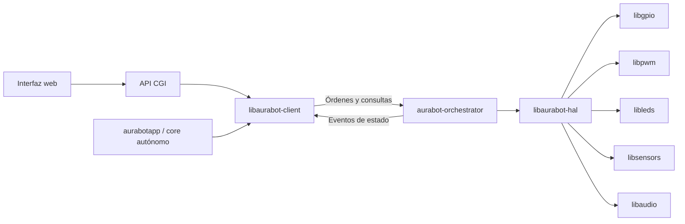
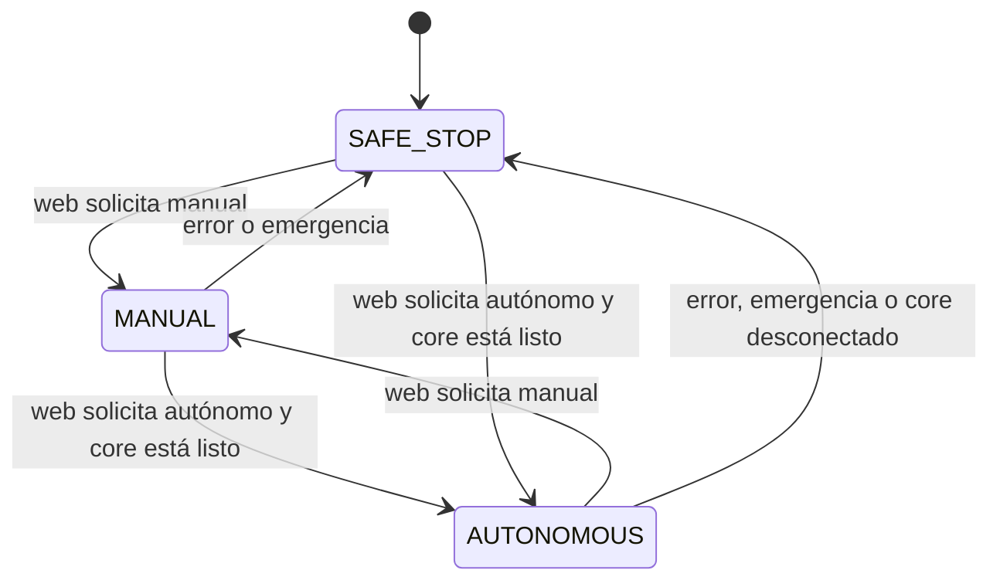

# Plan de implementación de la API de AuraBot

## 1. Objetivo

Crear una interfaz única y estable para que cualquier cliente de AuraBot pueda
controlar el robot sin enlazar ni conocer directamente `libgpio`, `libpwm`,
`libleds`, `libsensors` o `libaudio`.

Los primeros clientes serán:

- `operaciones.cgi`, que atiende la interfaz web actual.
- La futura `aurabotapp`, que implementará el comportamiento autónomo.

Las bibliotecas actuales continuarán existiendo como controladores de bajo
nivel. Solamente el servicio de hardware podrá utilizarlas directamente.

## 2. Estado actual

El repositorio ya contiene una primera separación por procesos:

```text
web -> operaciones.cgi -> FIFO /run/aurabot/control -> aurabot
                                                    -> libpwm/libgpio

web -> operaciones.cgi -> FIFO /run/aurabot-audio/control
                         -> aurabot-audio-server -> libaudio
```

Esta base evita que el CGI manipule GPIO directamente, pero todavía presenta
varias limitaciones:

- El protocolo FIFO es texto interno duplicado entre cliente y servidor.
- El cliente solamente sabe si pudo escribir; no conoce el resultado real.
- No hay consultas confiables de estado ni correlación solicitud/respuesta.
- Se exponen pines, frecuencias y polaridades en lugar de capacidades del robot.
- Hardware y audio tienen protocolos y servicios distintos.
- La futura aplicación autónoma tendría que repetir el código IPC del CGI.

## 3. Arquitectura objetivo

Se recomienda una biblioteca cliente y un orquestador persistente. En este
documento el ejecutable se llama provisionalmente `aurabot-orchestrator`; no es
solo un adaptador de hardware, sino la autoridad central del modo operativo y
del estado observable de la aplicación:



### Responsabilidad de cada capa

| Capa | Responsabilidad | No debe hacer |
|---|---|---|
| Clientes | Interfaz web, autonomía y decisiones de negocio | Conocer GPIO, PWM, ALSA o detalles físicos |
| `libaurabot-client` | API C estable, validación básica, conexión y serialización IPC | Acceder al hardware |
| `aurabot-orchestrator` | Modo, estado global, arbitraje, permisos, eventos, ejecución y apagado seguro | Implementar navegación o UI |
| `libaurabot-hal` | Traducir conceptos del robot a controladores físicos | Exponer transporte IPC/HTTP |
| Bibliotecas actuales | Operaciones específicas de bajo nivel | Ser consumidas por CGI o `aurabotapp` |

La biblioteca cliente no debe enlazar transitivamente las bibliotecas de
hardware. Esto permite compilar y probar los clientes incluso sin una Raspberry
Pi. El orquestador es el único proceso propietario de los recursos físicos y
resuelve conflictos entre el modo web y el modo autónomo.

### Autoridad de cada cliente

| Capacidad | Web/CGI | `aurabotapp` | Orquestador |
|---|---|---|---|
| Cambiar MANUAL/AUTONOMOUS | Solicita el cambio | Recibe el cambio | Valida, ejecuta y publica el modo |
| Movimiento en MANUAL | Envía órdenes | No tiene autoridad | Acepta solo órdenes web |
| Movimiento en AUTONOMOUS | Solo parada de emergencia | Envía órdenes del algoritmo | Acepta solo órdenes del core |
| LEDs de estado | Solo consulta su estado | Solicita encendido según eventos de estado | Valida, ejecuta y registra estado |
| Música | Reproducir, pausar, detener, volumen | No controla música | Conserva estado y ejecuta |
| Sonidos autónomos | No los dispara directamente | Solicita sonido por evento | Interrumpe/prioriza y luego restaura música |
| Estado visible | Se suscribe y lo muestra | Publica observaciones del algoritmo | Es la fuente de verdad y distribuye eventos |

Que `aurabotapp` decida qué LED representa cada estado no significa que acceda
al GPIO. Recibe el nuevo estado desde el orquestador y solicita el patrón de LED
mediante la API. El orquestador conserva el valor aplicado para que la web pueda
mostrarlo. Como protección, puede aplicar un patrón de error por defecto si
`aurabotapp` se desconecta.

### Flujos principales

El modo operativo pertenece al orquestador y se modela explícitamente:



Además del modo, el orquestador mantiene estados funcionales independientes
para movimiento, sensores, LEDs, música, efecto autónomo y salud. No conviene
crear un único enum combinando todas las posibilidades porque produciría una
máquina de estados difícil de extender.

**Cambio de modo solicitado desde la web**

1. La web solicita `set_mode(MANUAL|AUTONOMOUS)`.
2. El orquestador detiene primero ambos motores.
3. Para entrar en autónomo verifica que `aurabotapp` esté conectado y haya
   anunciado `READY`; si no, rechaza la transición y permanece detenido.
4. Cambia el propietario autorizado del movimiento.
5. Actualiza su estado y emite un evento a web y `aurabotapp`.
6. `aurabotapp` actualiza los LEDs y, en modo autónomo, inicia su algoritmo.

**Movimiento**

- En `MANUAL`, solo se aceptan órdenes con identidad de cliente web.
- En `AUTONOMOUS`, solo se aceptan órdenes con identidad de core autónomo.
- Una orden no autorizada devuelve `AURABOT_FORBIDDEN`; nunca se ignora como si
  hubiese funcionado.
- La parada de emergencia se acepta desde ambos clientes y tiene prioridad.

**Audio**

- La web posee la sesión de música: pista, reproducción, pausa y volumen.
- `aurabotapp` puede solicitar efectos asociados a estados, por ejemplo
  obstáculo, inicio o error.
- El orquestador guarda el estado de la música, la interrumpe, reproduce el
  efecto prioritario y después la reanuda desde el estado anterior.
- Los efectos tienen prioridad y política de cola explícitas. Para v1 se
  recomienda: `ERROR > ALERTA > NOTIFICACIÓN > MÚSICA`, sin mezclar audios y
  descartando notificaciones duplicadas pendientes.

## 4. API pública propuesta

La API pública debe hablar en términos del robot, no de pines. Un primer
contrato C podría ser:

```c
typedef struct aurabot_client aurabot_client_t;

typedef enum {
    AURABOT_OK = 0,
    AURABOT_INVALID_ARGUMENT,
    AURABOT_UNAVAILABLE,
    AURABOT_BUSY,
    AURABOT_FORBIDDEN,
    AURABOT_TIMEOUT,
    AURABOT_HARDWARE_ERROR,
    AURABOT_PROTOCOL_ERROR
} aurabot_result_t;

typedef enum {
    AURABOT_CLIENT_WEB,
    AURABOT_CLIENT_AUTONOMOUS
} aurabot_client_role_t;

typedef enum {
    AURABOT_MODE_MANUAL,
    AURABOT_MODE_AUTONOMOUS,
    AURABOT_MODE_SAFE_STOP
} aurabot_mode_t;

typedef enum {
    AURABOT_LED_STATUS,
    AURABOT_LED_MANUAL,
    AURABOT_LED_AUTONOMOUS,
    AURABOT_LED_OBSTACLE
} aurabot_led_t;

aurabot_result_t aurabot_connect(aurabot_client_role_t role,
                                 aurabot_client_t **client);
void aurabot_disconnect(aurabot_client_t *client);

aurabot_result_t aurabot_mode_set(aurabot_client_t *client,
                                  aurabot_mode_t mode);

aurabot_result_t aurabot_drive(aurabot_client_t *client,
                               int left_percent,
                               int right_percent);
aurabot_result_t aurabot_stop(aurabot_client_t *client);
aurabot_result_t aurabot_led_set(aurabot_client_t *client,
                                 aurabot_led_t led,
                                 int enabled);
aurabot_result_t aurabot_sensor_read(aurabot_client_t *client,
                                     unsigned sensor,
                                     int *value);
aurabot_result_t aurabot_audio_play(aurabot_client_t *client,
                                    unsigned track);
aurabot_result_t aurabot_audio_pause(aurabot_client_t *client);
aurabot_result_t aurabot_audio_stop(aurabot_client_t *client);
aurabot_result_t aurabot_audio_volume(aurabot_client_t *client,
                                      unsigned percent);
aurabot_result_t aurabot_status_get(aurabot_client_t *client,
                                    aurabot_status_t *status);
aurabot_result_t aurabot_subscribe(aurabot_client_t *client,
                                   aurabot_event_callback_t callback,
                                   void *context);
aurabot_result_t aurabot_effect_play(aurabot_client_t *client,
                                     aurabot_effect_t effect);
const char *aurabot_result_string(aurabot_result_t result);
```

Reglas del contrato:

- Velocidades usan `-100..100`; el signo representa la dirección.
- Volumen usa `0..100`; la conversión a la escala ALSA es interna.
- Los identificadores físicos se guardan en configuración del daemon.
- Todas las llamadas tienen timeout y devuelven un error normalizado.
- El rol declarado se verifica contra las credenciales del proceso conectado;
  no se confía solamente en un campo enviado por el cliente.
- El estado de salida solo cambia después de una respuesta exitosa del daemon.
- Detener motores y apagar salidas es seguro e idempotente.
- Las operaciones crudas por número de GPIO quedan fuera de la API de producto.
  Si todavía son necesarias, se conservan temporalmente como API de diagnóstico
  separada y deshabilitable.

## 5. Transporte entre biblioteca y daemon

Usar un socket Unix local, por ejemplo `/run/aurabot/control.sock`, en lugar del
FIFO. Para la primera versión es suficiente un protocolo versionado de mensajes
por línea, limitado en tamaño y con solicitud/respuesta:

```text
REQ 1 42 DRIVE -50 50
RES 1 42 OK

REQ 1 43 STATUS
RES 1 43 OK mode=manual left=-50 right=50 obstacle=0

RES 1 44 ERROR INVALID_ARGUMENT "volume must be 0..100"
```

Cada mensaje incluye versión y un identificador de solicitud. El socket debe
tener permisos restringidos a un usuario o grupo `aurabot`; no debe crearse con
modo `0666`. El parser debe imponer límites de longitud, validar todos los
campos y rechazar comandos desconocidos.

No es necesario introducir HTTP dentro del dispositivo: HTTP termina en el
CGI, y `libaurabot-client` oculta el IPC local. El protocolo puede cambiar en el
futuro sin alterar a los clientes mientras se conserve la API C.

## 6. Estado, eventos en tiempo real y seguridad operacional

El orquestador mantiene una única imagen del estado y serializa las órdenes. El
estado mínimo incluye modo, propietario del movimiento, conexión del core,
velocidad objetivo de ambos motores, sensores relevantes, LEDs aplicados,
estado de música, efecto activo, salud y último error.

Debe definirse desde el inicio una política para comandos simultáneos:

- `MANUAL`: acepta órdenes del CGI; la autonomía no controla motores.
- `AUTONOMOUS`: `aurabotapp` posee el movimiento; el CGI puede consultar estado,
  cambiar a manual y solicitar parada de emergencia.
- `SAFE_STOP`: motores detenidos después de un error, desconexión crítica o
  apagado.

El cambio de modo debe ser una transición atómica y siempre detener los motores
antes de transferir su propiedad. La parada de emergencia tiene prioridad sobre
cualquier propietario. Al recibir `SIGTERM`, perder una dependencia crítica o
encontrar un error de motor, el orquestador intenta dejar las salidas en estado
seguro antes de terminar.

Para la actualización web en tiempo real se recomienda un canal de eventos
separado de las órdenes:

```text
aurabot-orchestrator -> socket de suscripción -> eventos.cgi -> EventSource/SSE
                                                           -> navegador
```

`eventos.cgi` puede permanecer abierto y traducir los eventos locales a Server
Sent Events. SSE encaja porque el navegador solo necesita recibir estado; las
órdenes continúan por el CGI normal. Cada evento lleva un número de secuencia y
una instantánea o cambio de estado. Al reconectar, la web pide primero una
instantánea completa para no depender de eventos perdidos. Si mantener CGI
persistente resulta problemático con BusyBox, la primera entrega puede usar
polling corto de `status_get`, dejando SSE como siguiente incremento.

La configuración física puede vivir inicialmente en
`/etc/aurabot/hardware.conf` y mapear nombres lógicos a GPIO, canales, polaridad
y dispositivo ALSA. Los valores predeterminados pertenecen al paquete del
daemon, no a los clientes.

## 7. Migración incremental

### Fase 0: contrato y pruebas de caracterización

1. Inventariar todas las operaciones actuales del CGI, daemon de hardware y
   servidor de audio.
2. Congelar nombres, rangos, errores y estados de la API pública v1.
3. Añadir pruebas que documenten el comportamiento actual que debe conservarse.

Resultado: especificación v1 revisada y matriz operación-cliente-dispositivo.

### Fase 1: `libaurabot-hal`

1. Crear la receta y biblioteca con módulos `motors`, `leds`, `sensors`,
   `audio` y `system`.
2. Centralizar el mapeo lógico-físico y la conversión de unidades.
3. Inyectar interfaces de controladores para permitir dobles de prueba.
4. Probar estados seguros, límites y propagación de errores.

Resultado: ninguna lógica nueva del daemon usa directamente pines o ALSA.

### Fase 2: orquestador unificado y protocolo IPC

1. Evolucionar el ejecutable actual `aurabot` a `aurabot-orchestrator` o
   conservar el nombre temporalmente con la nueva responsabilidad documentada.
2. Implementar socket Unix, parser versionado, respuestas y timeouts.
3. Integrar audio en el mismo contrato. Durante la transición el orquestador puede
   adaptar internamente al servicio de audio existente antes de absorberlo.
4. Implementar estado, transiciones de modo, permisos por rol, arbitraje y
   parada segura.
5. Implementar interrupción de música, prioridad de efectos y restauración del
   estado musical.
6. Mantener el FIFO solo como adaptador de compatibilidad durante una versión.

Resultado: un único punto de control con respuesta verificable.

### Fase 3: `libaurabot-client`

1. Crear encabezado público, implementación del transporte y códigos de error.
2. Garantizar que solo dependa de libc y del protocolo, nunca de bibliotecas de
   hardware.
3. Agregar un backend falso o socket de prueba para ejecutar pruebas nativas.
4. Publicar SONAME y reglas de compatibilidad binaria.

Resultado: cualquier proceso C utiliza la misma API sin implementar IPC.

### Fase 4: migrar el CGI

1. Sustituir `send_command()` y rutas FIFO por llamadas a
   `libaurabot-client`.
2. Traducir `aurabot_result_t` a JSON y códigos HTTP consistentes.
3. Cambiar controles basados en pin por capacidades lógicas del robot.
4. Añadir consulta de estado y luego `eventos.cgi` + SSE para actualización en
   tiempo real.
5. Mantener las herramientas GPIO/PWM crudas solo en una pantalla diagnóstica,
   si siguen siendo un requisito.

Resultado: el CGI no conoce FIFO, GPIO, PWM ni ALSA.

### Fase 5: preparar `aurabotapp`

1. Crear un cliente de ejemplo que conecte con rol autónomo, se suscriba a
   cambios de modo y estado, controle LEDs, emita efectos de audio, envíe
   movimiento cuando tenga autoridad y se detenga limpiamente.
2. Documentar reconexión, timeouts y pérdida de propiedad.
3. Usarlo como esqueleto del futuro sistema autónomo. El core no cambia el modo;
   reacciona al modo ordenado desde la web.

Resultado: la autonomía puede desarrollarse y probarse contra un daemon falso.

### Fase 6: retirar compatibilidad

1. Eliminar los FIFO cuando CGI y herramientas ya utilicen la biblioteca.
2. Retirar `aurabot-audio-server` si su función fue absorbida.
3. Hacer fallar CI si un cliente enlaza `libgpio`, `libpwm`, `libleds`,
   `libsensors` o `libaudio`.
4. Actualizar diagramas, recetas, packagegroups e imagen Yocto.

Resultado: la frontera arquitectónica queda aplicada por compilación y CI.

## 8. Paquetes Yocto previstos

```text
recipes-lib/
  aurabot-hal/          # privada para el daemon
  aurabot-client/       # pública para CGI y aurabotapp

recipes-auraapp/
  aurabot-orchestrator/ # estado, arbitraje y servicio persistente de hardware
  aurabotapp/           # futura lógica autónoma
  webapp/               # enlaza únicamente aurabot-client
```

Dependencias deseadas:

```text
webapp       -> aurabot-client
aurabotapp   -> aurabot-client
aurabot-orchestrator -> aurabot-hal -> gpio/pwm/leds/sensors/audio
```

## 9. Plan delegable a agentes

Las tareas se pueden repartir por entregables con estas dependencias:

| Orden | Agente / frente | Entregable | Depende de |
|---|---|---|---|
| 1 | Contrato | ADR, encabezado v1, protocolo y matriz de errores | Nada |
| 2 | HAL | Biblioteca, configuración y unit tests con drivers falsos | Contrato |
| 2 | Cliente IPC | Biblioteca cliente y servidor falso de pruebas | Contrato |
| 2 | Yocto/CI | Esqueletos de recetas y reglas de dependencias prohibidas | Contrato |
| 3 | Orquestador | Socket, despacho, estado, permisos, modos y HAL | HAL + protocolo |
| 4 | Web | Migración del CGI, estado y canal SSE | Cliente + orquestador |
| 4 | Audio | Música, efectos prioritarios y restauración | Orquestador |
| 5 | Autonomía | Suscripción, movimiento, LEDs y efectos de `aurabotapp` | Cliente + orquestador |
| 6 | Integración | Imagen Yocto, pruebas en QEMU/Raspberry y retiro de FIFO | Todos |

Cada agente debe trabajar contra el contrato acordado; los cambios al encabezado
o protocolo requieren revisión conjunta para evitar implementaciones
incompatibles.

## 10. Estrategia de pruebas

- Unitarias: validación, mapeos, parser, estados y errores con hardware falso.
- Contrato: ejecutar la misma batería contra daemon falso y daemon real.
- Integración nativa: CGI -> biblioteca -> socket -> daemon falso.
- Integración QEMU: arranque, permisos, reconexión y respuestas sin hardware.
- Hardware real: motores, GPIO, sensores, audio, latencia y apagado seguro.
- Concurrencia: CGI y `aurabotapp` conectados simultáneamente, rechazo del
  emisor incorrecto, cambio atómico de modo y parada de emergencia.
- Eventos: reconexión de la web, eventos perdidos, instantánea inicial y orden
  creciente de secuencia.
- Audio: interrupción en cada estado musical, prioridades simultáneas y
  restauración posterior.
- Robustez: daemon ausente, mensajes truncados, cliente desconectado, timeout,
  comando inválido y reinicio del servicio.

## 11. Criterios de aceptación finales

- CGI y `aurabotapp` incluyen solamente `aurabot/client.h` para controlar el
  robot.
- Ningún cliente enlaza bibliotecas de hardware ni contiene números de GPIO.
- Cada solicitud obtiene éxito o error real del daemon dentro de un timeout.
- Dos clientes no pueden controlar motores simultáneamente sin arbitraje.
- En modo manual solo mueve la web; en autónomo solo mueve `aurabotapp`.
- Solo la web puede solicitar el cambio entre manual y autónomo.
- `aurabotapp` controla los LEDs mediante la API y la web refleja el valor
  aplicado en tiempo real.
- Un efecto autónomo interrumpe la música y la política definida determina su
  reanudación sin perder el estado de la sesión musical.
- Una parada de emergencia funciona independientemente del modo activo.
- El daemon deja los actuadores en estado seguro al detenerse.
- La configuración física puede cambiar sin recompilar los clientes.
- Las pruebas principales funcionan con dobles de hardware en CI.
- La imagen Yocto instala, inicia y supervisa el daemon con permisos mínimos.

## 12. Primera entrega recomendada

Para limitar el riesgo, el primer incremento vertical debe cubrir una sola
capacidad completa: `aurabot_led_set(AURABOT_LED_STATUS, enabled)` o, si no hay
LED lógico disponible, una operación temporal de salida digital diagnóstica.
Debe atravesar CGI, biblioteca cliente, socket, daemon, HAL y `libgpio`, incluir
respuesta real y pruebas. Una vez validado el recorrido se agregan motores,
sensores y audio sin volver a diseñar las capas.
