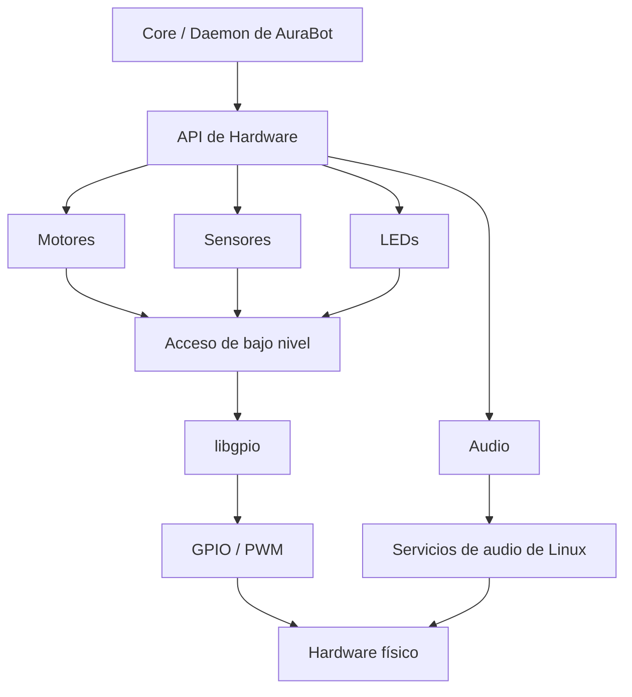

# Propuesta de API de Hardware de AuraBot

## 1. Objetivo

El objetivo de esta propuesta es definir una API de hardware única para AuraBot.

Esta API permitirá que el software principal del robot pueda controlar y consultar los dispositivos físicos sin conocer detalles de bajo nivel como números de GPIO, configuración de PWM o la forma específica en que funciona cada componente.

La biblioteca deberá cubrir principalmente:

- Motores.
- Sensores de proximidad.
- LEDs.
- Reproducción de audio.
- Inicialización y estado general del hardware.

---

## 2. Situación actual y ajuste propuesto

Actualmente el proyecto cuenta con dos bibliotecas principales:

- `libgpio`: contiene funciones de GPIO, PWM y también reproducción de audio.
- `libdriver`: utiliza `libgpio` para implementar el control de motores.

La propuesta es evolucionar `libdriver` hacia una biblioteca de hardware más general para AuraBot y cambiar su nombre posteriormente por uno que represente mejor su función.

Esta biblioteca será la interfaz principal que utilizará el software del robot para acceder al hardware.

`libgpio` se mantendrá como una biblioteca de bajo nivel utilizada internamente y no debería ser utilizada directamente por el software principal del robot.

---

## 3. Arquitectura propuesta

La organización general sería:

La idea principal es que el core del robot utilice solamente la API de hardware y no tenga que conocer cómo se implementa cada dispositivo.

---

## 4. Separación de `libgpio`

Actualmente `libgpio` mezcla funciones relacionadas con GPIO/PWM y funciones relacionadas con reproducción de audio.

La propuesta es separar estas responsabilidades.

`libgpio` debería encargarse únicamente de operaciones de bajo nivel relacionadas con GPIO y PWM.

La reproducción de audio pasaría a formar parte de un módulo propio de audio dentro de la biblioteca de hardware.

De esta forma cada parte del sistema tendrá una responsabilidad más clara.

---

## 5. Organización de la API por dispositivo

La API se dividirá según los principales dispositivos del robot.

### Motores

Permitirá controlar los dos motores del robot, incluyendo:

- Dirección.
- Velocidad.
- Detención.
- Estado básico del motor cuando sea necesario.

La API trabajará con conceptos como motor izquierdo y motor derecho, sin exponer los GPIO utilizados.

### Sensores

Permitirá obtener información de los sensores de proximidad.

Por ejemplo:

- Distancia frontal.
- Distancia lateral.
- Estado válido o inválido de una lectura.

La API deberá evitar depender directamente del modelo específico de sensor utilizado.

### LEDs

Permitirá controlar y consultar los LEDs utilizados como indicadores del sistema:

- Sistema encendido.
- Modo autónomo.
- Modo manual.
- Obstáculo detectado.

El resto del software no necesitará conocer qué GPIO utiliza cada LED.

### Audio

Permitirá controlar la reproducción de audio del robot.

Deberá contemplar:

- Reproducir.
- Pausar.
- Detener.
- Ajustar volumen.
- Consultar el estado de reproducción.

La administración de listas de canciones o archivos disponibles podrá mantenerse fuera de esta API.

### Sistema

La API también deberá contemplar operaciones generales relacionadas con el hardware, principalmente:

- Inicialización.
- Apagado seguro.
- Estado general.
- Manejo uniforme de errores.

---

## 6. Operaciones que expondrá la API

La API tendrá dos tipos principales de operaciones.

### Configurar o controlar hardware

Permitirá solicitar cambios sobre los dispositivos, por ejemplo:

- Cambiar la velocidad de un motor.
- Cambiar su dirección.
- Encender o apagar un LED.
- Reproducir o detener audio.
- Cambiar el volumen.

### Consultar hardware

También permitirá obtener información del sistema, por ejemplo:

- Leer una distancia de un sensor.
- Consultar el estado de un LED.
- Consultar el estado de reproducción de audio.
- Consultar información de movimiento si posteriormente se utilizan encoders.

Estas operaciones utilizarán internamente las funciones de bajo nivel necesarias, pero esos detalles no serán visibles para el core del robot.

---

## 7. Nivel de abstracción

La API utilizará un nivel de abstracción medio.

Esto significa que trabajará con conceptos propios del hardware del robot, como:

- Motor izquierdo.
- Motor derecho.
- Sensor frontal.
- Sensor lateral.
- LED de obstáculo.
- Volumen de audio.

La API no expondrá detalles como números de GPIO o configuración directa de PWM.

Tampoco incluirá decisiones de alto nivel como:

- Evitar un obstáculo.
- Ejecutar navegación autónoma.
- Limpiar una habitación.
- Construir el mapa.

Estas decisiones pertenecen al core del robot.

---

## 8. Responsabilidades que quedan fuera de la API

La API de hardware no será responsable de:

- Navegación autónoma.
- Construcción del mapa.
- Cambio entre modo manual y autónomo.
- Autenticación.
- Servidor web.
- BusyBox CGI.
- Comunicación HTTP/JSON.
- Comunicación IPC entre CGI y el daemon.
- Administración de la red.

Estas partes podrán utilizar información obtenida mediante la API, pero pertenecerán a otras capas del sistema.

---

## 9. Inicialización, estado y errores

La biblioteca deberá ofrecer un comportamiento uniforme para todos los dispositivos.

El sistema debería seguir un flujo general similar a:

1. Inicializar la biblioteca y los dispositivos necesarios.
2. Utilizar normalmente los dispositivos durante la ejecución del robot.
3. Detectar y reportar errores de forma consistente.
4. Dejar el hardware en un estado seguro al cerrar la aplicación.

Esto permitirá que el core del robot tenga una única forma de trabajar con motores, sensores, LEDs y audio.

---

## Principios de diseño

La propuesta seguirá estos principios:

- Existirá una única interfaz principal para acceder al hardware.
- El core del robot no accederá directamente a `libgpio`.
- Cada dispositivo tendrá responsabilidades claramente separadas.
- Los detalles físicos de GPIO y PWM permanecerán ocultos.
- La API representará capacidades del robot y no componentes específicos cuando sea posible.
- La estructura deberá permitir cambiar componentes físicos sin modificar gran parte del software principal.
