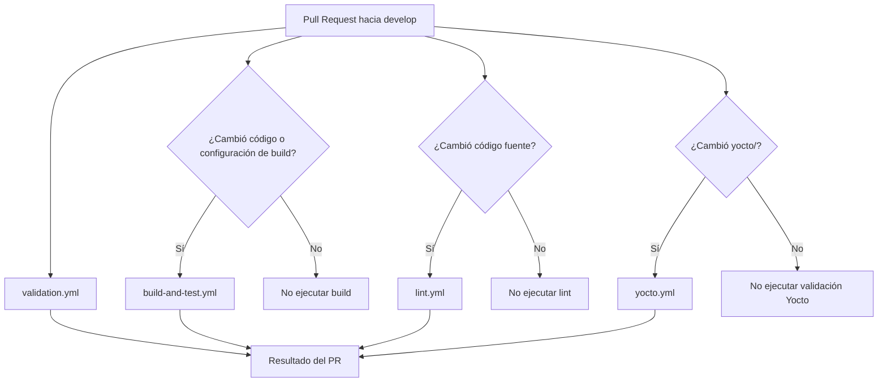
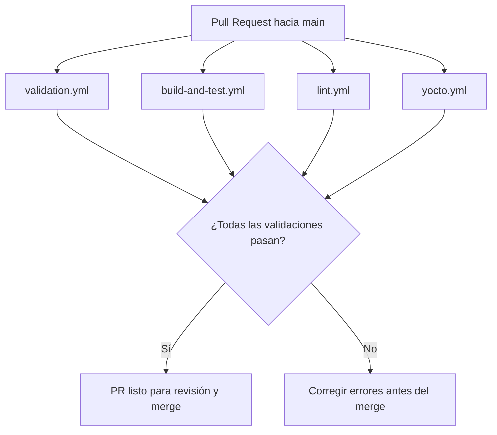

# Integración continua

## 1. Objetivo

Este documento describe la estrategia de Integración Continua (CI) utilizada en el repositorio mediante GitHub Actions.

El objetivo es validar automáticamente los cambios antes de integrarlos en `develop` o `main`, manteniendo un flujo simple y evitando ejecutar tareas pesadas cuando no sean necesarias.

---

## 2. Workflows definidos

La estructura prevista para CI es:

```text
.github/
└── workflows/
    ├── validation.yml
    ├── build-and-test.yml
    ├── lint.yml
    └── yocto.yml
```

Actualmente, `validation.yml` corresponde a la primera etapa implementada. Los demás workflows se integrarán cuando se definan las herramientas y tecnologías finales del proyecto.

---

## 3. `validation.yml`

Este workflow realiza validaciones generales del repositorio y no depende de las tecnologías utilizadas para desarrollar el proyecto.

Se ejecuta en Pull Requests hacia:

```text
develop
main
```

Valida:

* Archivos temporales o generados.
* Archivos mayores al límite permitido.
* Nombres básicos de archivos y carpetas.
* Existencia de la estructura base del repositorio.

Su propósito es detectar problemas simples antes de integrar cambios.

---

## 4. `build-and-test.yml`

Este workflow se implementará cuando se defina completamente el sistema de compilación y las herramientas de pruebas.

Su responsabilidad será:

* Compilar el código C/C++.
* Detectar errores de compilación.
* Ejecutar pruebas unitarias.
* Ejecutar pruebas de integración cuando corresponda.

En Pull Requests hacia `develop`, se buscará ejecutarlo únicamente cuando existan cambios relacionados con código, pruebas o configuración de compilación.

Ejemplos:

```text
src/**
tests/**
CMakeLists.txt
```

En Pull Requests hacia `main`, deberá ejecutarse como parte de la validación completa del proyecto.

---

## 5. `lint.yml`

Este workflow estará encargado de validar la calidad y consistencia del código.

Dependiendo de las herramientas seleccionadas, podrá incluir:

* Formato del código.
* Análisis estático.
* Errores comunes.
* Buenas prácticas de C/C++.
* Posibles problemas de sintaxis o implementación.

Se podrán utilizar herramientas como `clang-format`, `clang-tidy`, `cppcheck` u otras que se definan posteriormente.

Este workflow deberá ejecutarse principalmente cuando existan cambios en código fuente.

---

## 6. `yocto.yml`

Este workflow estará dedicado a validar los archivos y configuraciones relacionados con Yocto.

### Pull Requests hacia `develop`

Cuando un PR modifique contenido dentro de:

```text
yocto/**
```

se ejecutarán las validaciones de Yocto que se definan para comprobar que los cambios no introduzcan errores.

Dependiendo del entorno final, estas validaciones podrán incluir:

* Configuración de capas.
* Recetas.
* Metadata.
* Tareas de BitBake.
* Builds parciales o completos cuando sea necesario.

### Pull Requests hacia `main`

Todo Pull Request hacia `main` deberá realizar una validación completa de Yocto, independientemente de si el último cambio modificó directamente la carpeta `yocto/`.

El objetivo es comprobar que el estado final integrado del proyecto puede generar correctamente el entorno o imagen requerida.

---

## 7. Flujo CI hacia `develop`



La intención es ejecutar únicamente las validaciones relacionadas con los archivos modificados para reducir tiempo de ejecución y evitar trabajo innecesario.

---

## 8. Flujo CI hacia `main`

Los Pull Requests hacia `main` representan la integración final del proyecto y deberán pasar una validación más completa.



Esto permite verificar el estado completo del proyecto antes de integrar `develop` en `main`.

---

## 9. Resumen

| Workflow             | Propósito                                       | `develop`          | `main`  |
| -------------------- | ----------------------------------------------- | ------------------ | ------- |
| `validation.yml`     | Validar estructura y archivos del repositorio   | Siempre            | Siempre |
| `build-and-test.yml` | Compilar y ejecutar pruebas                     | Según cambios      | Siempre |
| `lint.yml`           | Revisar calidad y buenas prácticas del código   | Según cambios      | Siempre |
| `yocto.yml`          | Validar configuración y funcionamiento de Yocto | Si cambia `yocto/` | Siempre |

La estrategia busca mantener una CI útil y progresiva, agregando validaciones únicamente cuando exista una necesidad concreta y las herramientas del proyecto estén definidas.
