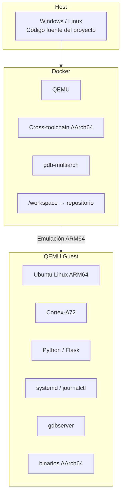

# Entorno de desarrollo ARM64 con Docker y QEMU

## 1. Objetivo

Este documento describe el entorno de desarrollo basado en Docker + QEMU utilizado para ejecutar y verificar software ARM64 sin depender constantemente de la Raspberry Pi 4 Model B física.

El entorno permite trabajar con un Linux ARM64 genérico utilizando una CPU Cortex-A72 emulada, similar a la arquitectura utilizada por la Raspberry Pi 4.

Este entorno está pensado para validar software. No reemplaza las pruebas sobre hardware real.

---

## 2. ¿Para qué se utiliza?

El entorno permite verificar, entre otras cosas:

* Ejecución de programas compilados para AArch64.
* Cross-compilation de código C.
* Bibliotecas dinámicas `.so`.
* Python y Flask sobre ARM64.
* Integración futura mediante `ctypes`.
* Servicios de `systemd`.
* Logs mediante `journalctl`.
* Depuración remota con GDB y `gdbserver`.

No permite validar correctamente:

* GPIO físico.
* PWM real.
* Motores.
* Sensores.
* Hardware de audio.
* Timing real de la Raspberry Pi.

Estas funcionalidades deberán probarse posteriormente sobre la placa física.

---

## 3. Arquitectura del entorno



Es importante distinguir:

```text
Docker != QEMU
```

Docker contiene las herramientas de desarrollo y QEMU.

QEMU ejecuta el sistema Linux ARM64 donde se prueban los programas destinados al sistema embebido.

---

## 4. Archivos relacionados

El entorno se encuentra en:

```text
docker/qemu/
├── Dockerfile
├── start.sh
└── scripts/
    └── run-qemu.sh
```

* `Dockerfile`: define las herramientas disponibles dentro del entorno Docker.
* `start.sh`: construye y ejecuta automáticamente el entorno.
* `run-qemu.sh`: inicia la máquina virtual ARM64 dentro del container.

El estado local de QEMU se almacena en:

```text
.qemu/
```

Esta carpeta no debe almacenarse en Git.

---

## 5. Requisitos previos

### Windows + WSL

Se requiere:

* WSL con una distribución Linux.
* Docker Desktop instalado en Windows.
* Integración de Docker Desktop habilitada para la distribución WSL utilizada.
* Git.

Desde WSL debe funcionar:

```bash
docker --version
docker info
```

### Linux nativo

Se requiere:

* Docker Engine.
* Git.

El usuario debe tener permisos para ejecutar Docker.

Se puede comprobar con:

```bash
docker --version
docker info
```

No es necesario instalar QEMU ni el cross-toolchain ARM64 manualmente.

---

## 6. Iniciar el entorno

Todos los comandos deben ejecutarse desde la raíz del repositorio.

La primera vez se deben asignar permisos de ejecución:

```bash
chmod +x docker/qemu/start.sh
chmod +x docker/qemu/scripts/run-qemu.sh
```

Luego basta con ejecutar:

```bash
./docker/qemu/start.sh
```

La primera ejecución puede tardar debido a que:

1. Docker construye la imagen `aurabot-qemu`.
2. Se descarga la imagen de Ubuntu ARM64.
3. Se crea el disco virtual.
4. QEMU inicia el sistema ARM64.
5. El guest configura sus paquetes iniciales.

Las siguientes ejecuciones reutilizan la imagen Docker y el estado almacenado en `.qemu/`.

---

## 7. Verificar Docker

Desde otra terminal:

```bash
docker ps
```

Debe aparecer un container similar a:

```text
aurabot-qemu
```

Para comprobar la imagen:

```bash
docker images aurabot-qemu
```

---

## 8. Entrar al container Docker

Para abrir una terminal dentro del entorno Docker:

```bash
docker exec -it aurabot-qemu bash
```

El prompt será similar a:

```text
[aurabot-dev@<container> workspace]$
```

Dentro del container se pueden utilizar herramientas como:

```bash
aarch64-linux-gnu-gcc --version
gdb-multiarch --version
cmake --version
```

El repositorio se encuentra montado en:

```text
/workspace
```

Por lo tanto:

```text
Repositorio en WSL/Linux
        ↕
/workspace dentro de Docker
```

Los cambios realizados en `/workspace` aparecen directamente en el repositorio.

Para salir:

```bash
exit
```

---

## 9. Entrar al Linux ARM64 de QEMU

Desde WSL o Linux:

```bash
ssh -p 2222 aurabot@localhost
```

Usuario:

```text
aurabot
```

Contraseña de desarrollo:

```text
aurabot
```

El prompt será similar a:

```text
aurabot@aurabot-arm64:~$
```

Para comprobar la arquitectura:

```bash
uname -m
```

Resultado esperado:

```text
aarch64
```

También se puede comprobar la CPU:

```bash
lscpu
```

Debe mostrar información similar a:

```text
Architecture: aarch64
Model name: Cortex-A72
CPU(s): 4
```

Para salir:

```bash
exit
```

---

## 10. Copiar archivos al guest QEMU

Los archivos del repositorio están disponibles directamente dentro de Docker mediante `/workspace`.

Para enviarlos al Linux ARM64 de QEMU se utiliza `scp`.

Ejemplo:

```bash
scp -P 2222 \
    archivo \
    aurabot@localhost:/opt/aurabot/
```

Para copiar varios archivos:

```bash
scp -P 2222 \
    archivo1 \
    archivo2 \
    aurabot@localhost:/opt/aurabot/
```

Luego se pueden utilizar dentro del guest:

```bash
ssh -p 2222 aurabot@localhost
cd /opt/aurabot
```

---

## 11. Cross-compilar código C

La cross-compilation se realiza dentro del container Docker.

Entrar al container:

```bash
docker exec -it aurabot-qemu bash
```

Ejemplo:

```bash
aarch64-linux-gnu-gcc \
    -Wall \
    -Wextra \
    -g \
    -O0 \
    /workspace/tests/integration/qemu/hello.c \
    -o /workspace/tests/integration/qemu/hello-arm64
```

Comprobar la arquitectura:

```bash
file /workspace/tests/integration/qemu/hello-arm64
```

Debe indicar:

```text
ARM aarch64
```

También se puede utilizar:

```bash
aarch64-linux-gnu-readelf -h \
    /workspace/tests/integration/qemu/hello-arm64
```

y verificar:

```text
Class:   ELF64
Machine: AArch64
```

---

## 12. Ejecutar un binario ARM64

Después de compilarlo, copiarlo al guest:

```bash
scp -P 2222 \
    tests/integration/qemu/hello-arm64 \
    aurabot@localhost:/opt/aurabot/
```

Entrar:

```bash
ssh -p 2222 aurabot@localhost
```

Ejecutar:

```bash
cd /opt/aurabot
./hello-arm64
```

Esto permite comprobar que un binario generado mediante cross-compilation funciona correctamente sobre Linux ARM64.

---

## 13. Bibliotecas dinámicas

Las bibliotecas `.so` también pueden cross-compilarse dentro de Docker.

Ejemplo:

```bash
aarch64-linux-gnu-gcc \
    -Wall \
    -Wextra \
    -fPIC \
    -shared \
    archivo.c \
    -o libejemplo.so
```

Dentro del guest se pueden consultar las dependencias:

```bash
ldd programa
```

Si la biblioteca no se encuentra automáticamente, durante desarrollo se puede indicar su ubicación:

```bash
export LD_LIBRARY_PATH=/opt/aurabot
```

Luego:

```bash
ldd programa
./programa
```

Este mecanismo será utilizado posteriormente con la biblioteca dinámica propia del proyecto.

---

## 14. Flask

Flask se ejecuta dentro del guest ARM64.

Ejemplo:

```bash
ssh -p 2222 aurabot@localhost
cd /opt/aurabot
python3 flask_app.py
```

Flask debe escuchar en:

```text
0.0.0.0:5000
```

Desde Windows o Linux se puede acceder mediante:

```text
http://localhost:5000
```

El flujo es:

```text
Navegador
    ↓
localhost:5000
    ↓
Docker
    ↓
QEMU
    ↓
Flask sobre ARM64
```

---

## 15. GDB y gdbserver

`gdbserver` se ejecuta dentro del guest ARM64.

### Dentro de QEMU

```bash
ssh -p 2222 aurabot@localhost
cd /opt/aurabot
gdbserver 0.0.0.0:1234 ./programa
```

Debe aparecer:

```text
Listening on port 1234
```

### Dentro de Docker

En otra terminal:

```bash
docker exec -it aurabot-qemu bash
```

Luego:

```bash
gdb-multiarch /workspace/ruta/al/programa
```

Dentro de GDB:

```text
set architecture aarch64
target remote localhost:1234
break main
continue
```

Comandos útiles:

```text
list
next
step
print <variable>
continue
backtrace
quit
```

Esto permite depurar desde el entorno de desarrollo un programa que realmente se está ejecutando sobre ARM64 dentro de QEMU.

---

## 16. systemd y journalctl

Dentro del guest se pueden administrar servicios normalmente.

Ejemplo:

```bash
sudo systemctl daemon-reload
sudo systemctl start <servicio>
systemctl status <servicio>
```

Para consultar logs:

```bash
journalctl -u <servicio> --no-pager
```

Para observarlos en tiempo real:

```bash
journalctl -u <servicio> -f
```

También se puede revisar el journal general del arranque:

```bash
journalctl -b
```

Este mecanismo será utilizado posteriormente para el servicio principal de AuraBot.

---

## 17. Detener el entorno

Si `start.sh` está ejecutándose en primer plano, se puede detener QEMU con:

```text
Ctrl+C
```

También se puede detener desde otra terminal:

```bash
docker stop aurabot-qemu
```

Para volver a iniciar el entorno:

```bash
./docker/qemu/start.sh
```

---

## 18. ¿Dónde desarrollar cada cosa?

| Entorno        | Uso principal                                             |
| -------------- | --------------------------------------------------------- |
| WSL / Linux    | Editar código, Git y manejo general del repositorio       |
| Docker         | Cross-compilation, herramientas AArch64 y `gdb-multiarch` |
| QEMU guest     | Ejecutar y verificar software ARM64                       |
| Raspberry Pi 4 | GPIO, PWM, sensores, motores, audio y hardware real       |

La regla general es:

```text
Desarrollar
    ↓
Cross-compilar en Docker
    ↓
Verificar software en QEMU
    ↓
Validar hardware en Raspberry Pi
```

---

## 19. Resumen

| Elemento                | Función                                                            |
| ----------------------- | ------------------------------------------------------------------ |
| Docker                  | Proporciona un entorno común de desarrollo                         |
| QEMU                    | Ejecuta un Linux ARM64 emulado                                     |
| Cortex-A72              | CPU ARM utilizada para aproximar la arquitectura de Raspberry Pi 4 |
| `/workspace`            | Repositorio compartido entre host y Docker                         |
| SSH `2222`              | Acceso al guest QEMU                                               |
| Flask `5000`            | Acceso a la interfaz web                                           |
| GDB `1234`              | Depuración remota                                                  |
| `aarch64-linux-gnu-gcc` | Cross-compilación inicial para ARM64                               |
| `gdb-multiarch`         | Depuración desde Docker                                            |
| `gdbserver`             | Depuración del programa dentro de ARM64                            |
| systemd                 | Administración de servicios                                        |
| journalctl              | Consulta de logs                                                   |

Para iniciar el entorno normalmente solo es necesario ejecutar:

```bash
./docker/qemu/start.sh
```

Después se puede acceder al entorno Docker con:

```bash
docker exec -it aurabot-qemu bash
```

o directamente al Linux ARM64 con:

```bash
ssh -p 2222 aurabot@localhost
```

QEMU permite validar gran parte del software sin disponer físicamente de la Raspberry Pi, mientras que la placa real seguirá siendo necesaria para todas las funcionalidades relacionadas con hardware.
