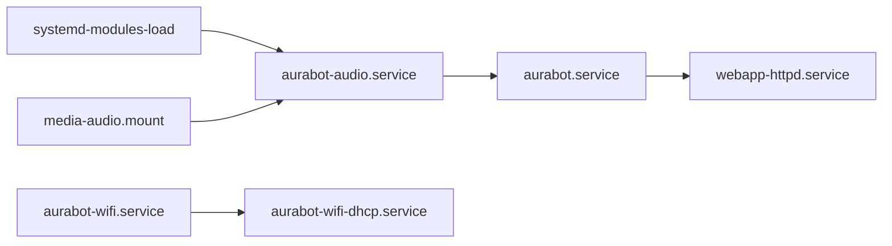

# Servicios systemd de AuraBot

`build.sh` selecciona `INIT_MANAGER = "systemd"`. Las recetas heredan la clase
`systemd`, instalan sus unidades en `${systemd_system_unitdir}` y las habilitan
durante la construcción de la imagen.



Los servicios de audio, robot, web, asociación Wi-Fi y DHCP usan
`Restart=on-failure`. `StartLimitBurst` evita ciclos de reinicio ilimitados en
fallos permanentes. Los procesos permanecen en primer plano para que systemd
observe directamente su PID y registre stdout/stderr en el journal.

Comandos de operación:

```sh
systemctl status aurabot.service
systemctl restart webapp-httpd.service
journalctl -b -u aurabot.service -f
systemctl show aurabot.service -p Restart -p NRestarts -p MemoryCurrent
systemd-analyze critical-chain webapp-httpd.service
```

La salida analógica se carga mediante `systemd-modules-load` y la configuración
`/etc/modprobe.d/snd-bcm2835.conf`. El servidor de audio detecta la tarjeta
`Headphones`; se puede fijar otra creando `/etc/default/aurabot-audio`:

```sh
AURABOT_AUDIO_DEVICE="plughw:Headphones,0"
```

La interfaz Wi-Fi predeterminada es `wlan0`. Puede sobrescribirse en
`/etc/default/aurabot-wifi` con `WIFI_INTERFACE=...`.
